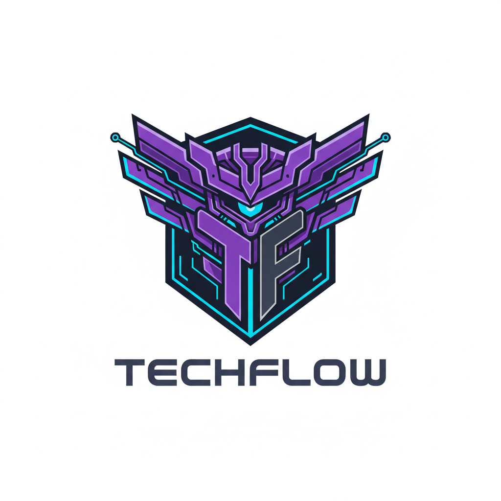

<div align="center">
  <h1 align="center"> ✨ Tech-Flow: Portal de Chamados Inteligente ✨ </h1>
  <h3 align="center"> Conectando Suporte e Soluções com Fluidez e Inteligência </h3>
  
  <br>
  <h2 align="center"> Tech-Flow | UNIP São José dos Campos</h2>

---

## Sobre a Tech-Flow <a id="sobre"></a>

Somos uma equipe de desenvolvedoras e desenvolvedores do ambiente acadêmico da UNIP de São José dos Campos. Movidos pela **paixão** por tecnologia e **dedicação**, nosso grupo se dedica a aplicar conhecimento técnico de ponta na resolução de problemas práticos do mercado. Unimos uma base teórica sólida com uma abordagem ágil e **muito cuidado** para transformar desafios em software, visando como produto um portal de chamados que realmente faz a diferença.

## Proposta <a id="proposta"></a>

Nosso objetivo é desenvolver um **portal de chamados inteligente** que promove a **fluidez** no atendimento técnico e a **conexão** clara entre clientes e atendentes. Utilizando **Inteligência Artificial**, o sistema realiza triagem automática e classificação de solicitações com precisão, além de sugerir soluções para problemas frequentes. Isso otimiza o tempo de resposta, garante uma **melhor organização** dos chamados e reduz a sobrecarga da equipe de TI, permitindo um foco maior no **acolhimento** e na solução.

---

<details>
<summary> Backlog do Produto 📋 <a id="backlog"></a> </summary>

### **Épico 1: Cadastro e Autenticação**
* *US01: Cadastro de Usuário Final* (5 SP)
* *US02: Cadastro de Técnico/Atendente* (5 SP)
* *US03: Autenticação de Login* (8 SP)

### **Épico 2: Gestão de Chamados e Interações**
* *US04: Alteração de status* (8 SP)
* *US05: Comentários internos e externos* (13 SP)

### **Épico 3: Priorização e Filtros Avançados**
* *US06: Definição de prioridade* (5 SP)
* *US07: Filtros por data, status, prioridade e categoria* (13 SP)

### **Épico 4: Relatórios e Auditoria**
* *US08: Log de alterações (auditoria)* (8 SP)
* *US09: Relatórios de desempenho* (13 SP)

### **Épico 5: Interface Responsiva e Acessibilidade**
* *US10: Layout responsivo e acessível* (13 SP)

### **Épico 6: Escalabilidade e Performance**
* *US11: Otimizações de performance* (13 SP)
</details>

---

<details>
<summary> Cronograma (Sprints) 🗓️ <a id="cronograma"></a> </summary>

| Período da Sprint | Documentação da Sprint |
| :--- | :---: |
| **Sprint 1:** Fundação do Portal de Chamados - 05/08/2025 - 25/08/2025 | [link] |
| **Sprint 2:** Interação e Status dos Chamados - 25/08/2025 - 01/09/2025 | [link] |
| **Sprint 3:** Comunicação Cliente e Priorização - 01/09/2025 - 05/09/2025 | [link] |
| **Sprint 4:** Busca e Início da Classificação - 05/09/2025 - 10/09/2025 | [link] |
| **Sprint 5:** Filtros Avançados e Classificação (IA) - 14/09/2025 - 18/09/2025 | [link] |
| **Sprint 6:** Histórico e Relatórios Iniciais - 20/09/2025 - 22/09/2025 | [link] |
| **Sprint 7:** Exportação e Interface Responsiva - 23/09/2025 - 25/09/2025 | [link] |
| **Sprint 8:** Acessibilidade, Segurança e Otimizações - 25/09/2025 - 01/10/2025 | [link] |
</details>

---

<details>
<summary> Tecnologias Utilizadas 💻 <a id="tecnologias"></a> </summary>

* **Banco de Dados**: MySql
* **Design de Interface**: Figma
* **Linguagem Back-end**: Java (implícito na estrutura de pastas)
</details>

---

<details>
<summary> 📂 Estrutura do Projeto <a id="estrutura"></a> </summary>

```text
📁 techflow/
├── 📁 docs/
├── 📁 src/
│   ├── 📁 main/
│   │   ├── ☕ java/
│   │   └── 📄 resources/
│   └── 📁 test/
├── 📜 .gitignore
└── 📄 README.md
```
</details>

---
<details>
<summary> Como Usar: Simplificando o Seu Dia 💡 <a id="como-usar"></a> </summary>

Queremos garantir que você aproveite ao máximo a **facilidade** do nosso portal de chamados:

* **1. Registro de Chamados**
    * Sinta-se à vontade para **abrir seu chamado** descrevendo o problema de forma clara e definindo a prioridade ideal.
* **2. Visualização e Gerenciamento**
    * Nossos atendentes podem visualizar, **editar** e **alterar o status** dos chamados com agilidade e organização.
* **3. Pesquisa e Filtros**
    * Utilize nossos filtros avançados para buscar chamados de maneira **intuitiva** por **status, prioridade, responsável, cliente, data** 🔍
* **4. Relatórios Detalhados**
    * Tenha acesso a **análises completas** e transparentes sobre o desempenho e tempo de resposta da equipe.
</details>

---

<details>
<summary> Equipe - TechFlow | Nossas Desenvolvedoras e Desenvolvedores 🧑‍💻👩‍💻 <a id="equipe"></a> </summary>

| Nome | Papel | GitHub |
| :--- | :--- | :---: |
| **Tainara Lais Viana Mota** | Product Owner | [@TainaraViana](https://github.com/TainaraViana) |
| **André Takashi Prado Takamura** | Scrum Master | [@Yashatk](https://github.com/Yashatk) |
| **Fabrício Santos Cavalcante** | Desenvolvedor | [@Kinnube](https://github.com/Kinnube) |
| **Thiago Paulino da Silva** | Desenvolvedor | [@thiagooo9](https://github.com/thiagooo9) |
</details>

---
